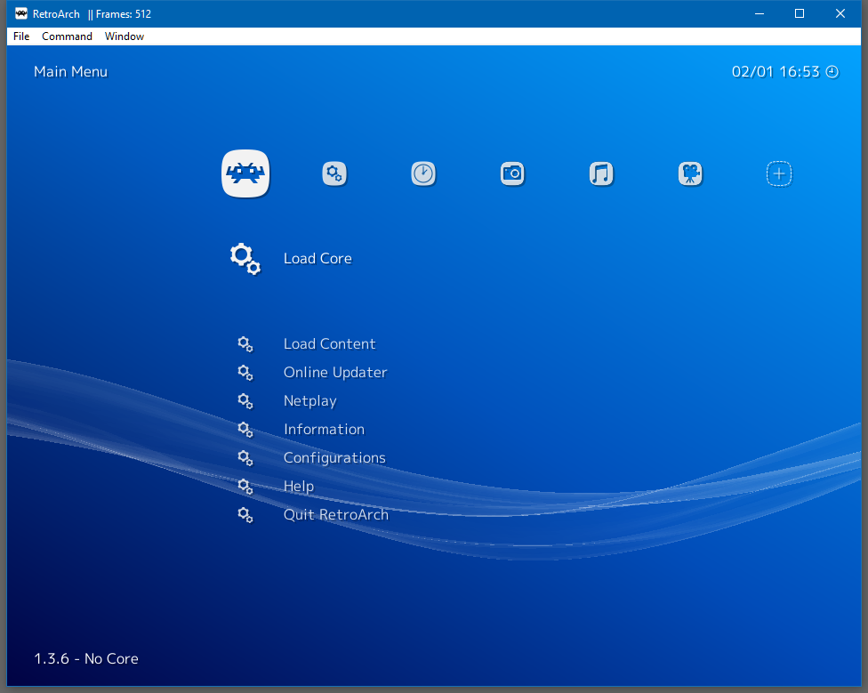
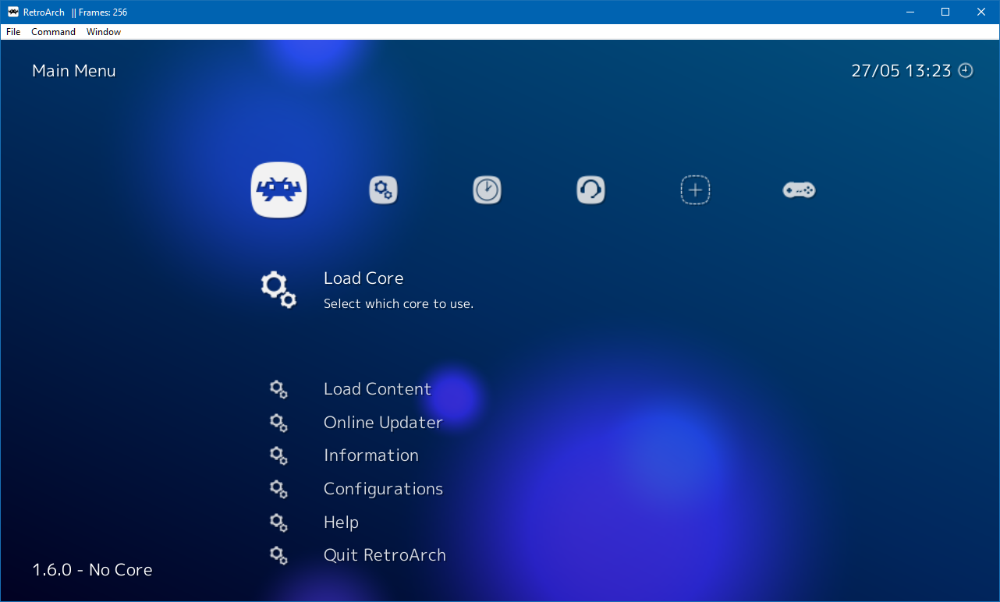

# Getting Started with RetroArch

## Installing RetroArch

You can either download a stable release [here](https://buildbot.libretro.com/stable/1.3.6/windows/) or a current nightly [here](https://buildbot.libretro.com/nightly/windows/).
There are several files you can download in these folders. For a new installation you want **RetroArch.7z**.

Extract **RetroArch.7z** in a folder that doesn't require administrator permissions such as *C:\Users\yourusername\RetroArch*. Don't install to *Program Files* or your Windows folder.

This distribution method has several advantages:

- It's portable
- It's self-contained
- It doesn't need users to guess random locations for configurations files
- It's easy to update

## Updating RetroArch

If you were running a stable release prior to 1.4.0. you will need to update the system libraries. You can do so by downloading the full **RetroArch.7z** package or grabbing **redist.7z** from the download locations.
To update RetroArch it's enough to download the current dated **2017-XX-XX_RetroArch.7z** and extract it on-top of your existing installation.

## Using RetroArch
### First Run

At first you will be greeted by this screen:

This is one of three production ready menu drivers. It is called XMB and it tries to follow PS3 XMB menu layout as closely as possible.

### Navigation

The menu is designed with gamepad navigation in mind but it does have keyboard support. The keyboard controls are:

Manu                        ||In-game      ||
------------- | ------------ |------------- | ------------ 
**Key**       | **Action**   |**Key**       |**Action**
    | Move cursor up                  |    | Menu toggle
  | Move cursor down                |    | Save state
  | Move cursor left                |    | Load state
 | Move cursor right               |    | Increase current state slot
   | Scroll one page down            |    | Decrease current state slot
     | Scroll one page up              |    | Take screenshot
   | Scroll one page down            |    | Mute
       | Select                          |   | Show on-screen keyboard
   | Return to the previous screen   |   | Grab mouse
       | Help                            |  | Volume Up
       | Reset to default                | | Volume Down
       | Search                          | | Fast forward toggle
         | Exit RetroArch                  |     | Fast forward hold
                                                                   |                                 |     | Rewind
                                                                   |                                 |     | Movie record
                                                                   |                                 |     | Pause
                                                                   |                                 |     | Frame advance
                                                                   |                                 |     | Reset
                                                                   |                                 |     | Next shader
                                                                   |                                 |     | Previous shader
                                                                   |                                 |     | Netplay toggle play/spectate
                                                                   |                                 |     | Slow motion
                                                                   
                                                                   

### Gamepad Configuration

By default, XINPUT controllers should work out of the box. If the controller can be autoconfigured the OSD will inform you of the autoconfiguration event:

If the controller is not autoconfigured you might need to map the controller manually with the following procedure:

- Navigate to **Settings**
- Navigate to **Input**
- Navigate to **Input User 1 Binds**
- Select **User 1 Bind All**
- Press the buttons as required

!!! tip
    If you have several different controller types you may want to use the **User 1 Save Autoconfig** and ** User 1 Bind Default All** options after binding in order to achieve hotplug-like functionality

### Directory Configuration

Configuring directories is an important aspect to get the best RetroArch experience possible.
To configure the directories follow these steps:

- Navigate to **Settings**
- Navigate to **Directories**
- Select the directory you want to changed
- Navigate to the desired location

You should always configure are:

- System Directory
- Savefile Directory
- Savestate Directory
- Browser Directory

## Glossary

#### frontend
A frontend is a program designed to run libretro cores such as Kodi's RetroPlayer, RetroArch, Phoenix, Minir

#### core
A core is a program that has been ported to the libretro API and runs inside a libretro frontend

#### content

Content can be a game, an image, a video, an audio file that is executed by a core. In most cases contents are the ROMs of an emulated platform

#### retropad

RetroPad is libretro’s input abstraction controller, it’s the interface between the physical controller and the core inputs

#### save files

Save files are saves that are made from within a game, usually cross platform and should work across emulators in most cases

#### save states

Save states are snapshots of the content menory at a particular moment, these are not always cross platform and most certainly won’t work on a different emulator that the one used to create them

#### system files

Additional files that might or not be part of the romset that might be needed to get some content to work (usually referred to by the BIOS term)

#### autoconf profile

A configuration file that has button definitions for a particular gamepad

