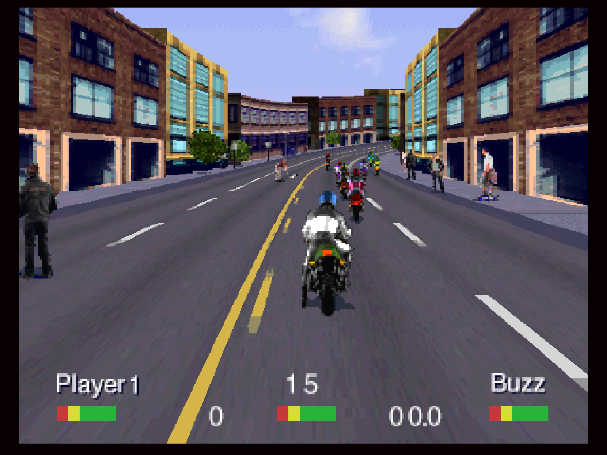

# 3DO (4DO)

## Background

4DO is an open-source, low-level emulator for the 3DO Game Console based on the FreeDO source code.

Author(s): JohnnyDude|FreeDO team

## Contribute to this documentation

In order to propose improvements to this document, [visit it's corresponding source page on github](https://github.com/libretro/docs/tree/master/docs/library/4DO.md). Changes are proposed using "Pull Requests."

## License

Non-commercial

## Extensions

iso|cue

## BIOS

|   Filename   |      Description                |              md5sum              |
|:------------:|:-------------------------------:|:--------------------------------:|
| panafz10.bin | Panasonic FZ-10 BIOS - Required | 51f2f43ae2f3508a14d9f56597e2d3ce |

## Features

| Feature           | Supported |
|-------------------|:---------:|
| Saves             | ✔         |
| States            | ✔         |
| Rewind            | ✔         |
| Netplay           | ✔         |
| RetroAchievements | ✕         |
| RetroArch Cheats  | ✕         |
| Native Cheats     | ✕         |
| Controllers       | ✕         |
| Rumble            | ✕         |
| Sensors           | ✕         |
| Camera            | ✕         |
| Location          | ✕         |
| Subsystem         | ✕         |

The 4DO core creates directories named 4DO in RetroArch's save and state directories 

Game data is saved/loaded to and from the core's save directory  

Save states are saved/loaded to and from the core's state directory. 

## Options

The 4DO core has the following options that can be tweaked from the core options menu. The default setting is bolded.

- **High Resolution (restart)** (**Off**/On): Doubles internal resolution.

??? note "*Disabled*"
    

??? note "*Enabled*"
    

## Controllers

The 4DO core supports one controller setting(s):

* RetroPad

| 4DO           | RetroPad                                                       |
|---------------|----------------------------------------------------------------|
| B             |                |
| A             |                |
| X (Stop)      |            |
| P (Play/Pause |              |
| Up            |             |
| Down          |           |
| Left          |           |
| Right         |          |
| C             |                |
| L             |                    |
| R             |                    |

## Compatibility

[4DO Compatibility List](http://wiki.fourdo.com/Compatibility_List)

| Game                                      | Issue                                                                  |
|:-----------------------------------------:|:----------------------------------------------------------------------:|
|**Advanced Dungeons & Dragons - Deathkeep**|Random softlocks (music related?).                                      |
|**Alone in the Dark**                      |Unreadable text within books. Audio glitches.                           |
|**DinoPark Tycoon**                        |Graphics glitches.                                                      |
|**Eye of Typhoon, The**                    |Runs too fast.                                                          |
|**Horde, The**                             |Graphics glitches. Minor graphical inaccuracy in bird's eye map.        |
|**Primal Rage**                            |Audio glitches.                                                         |
|**Psychic Detective**                      |Audio glitches. Sound is sometimes static during videos.                |
|**Shadow - War of Succession**             |Runs too fast.                                                          |
|**Tetsujin Return**                        |Graphics glitches. Missing graphics for obstacles in the driving scenes.|

## External Links

* [Libretro Repository](https://github.com/libretro/4do-libretro)
* [Report Core Issues Here](https://github.com/libretro/libretro-meta/issues)
* [Official Website](http://www.fourdo.com/)
* [Official Repository](https://sourceforge.net/projects/fourdo/)
