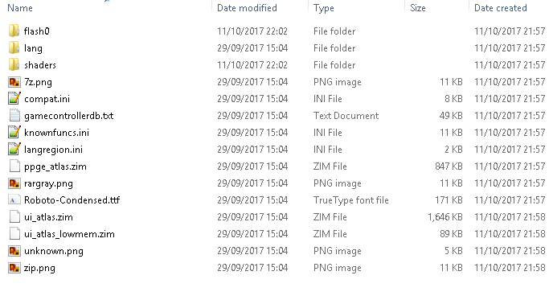

# PSP (PPSSPP)

## Background

PPSSPP is a fast and portable Sony PSP emulator that can be used as a Libretro core

Author(s):Henrik Hrydgard

### Changelog

Can be found [Here](https://github.com/libretro/ppsspp/blob/master/README.md)

## Contribute to this documentation

+In order to propose improvements to this document, [visit it's corresponding source page on github](https://github.com/libretro/docs/tree/master/docs/library/ppsspp.md). Changes are proposed using "Pull Requests."

## License

GPLv2

## Extensions

elf|iso|cso|prx|pbp

## BIOS

The PPSSPP core requires assets files to be fully functional. These assets include fonts and backgrounds that are required for memory card screens amongst other things.

Libretro has two sources available for the required files.

!!! warning
    Method 1 is currently broken. Please use method 2.

1. Within Retroarch navigate to `Main Menu -> Online Updater -> Content Downloader -> PPSSPP`
    Extract the downloaded `ppsspp-data.zip` into `system/PPSSPP`
2. Visit https://github.com/libretro/ppsspp and `Clone or Download` this repository.
    Extract the ppsspp-master.zip
    Copy the contents of `ppsspp-master/assets` into `system/PPSSPP`

### System Directory

You should end up with this

     

## Features

**Update required**

| Feature           | Supported |
|-------------------|:---------:|
| Saves             | ✔         |
| States            | ✔         |
| Rewind            | ✔         |
| Netplay           | -         |
| RetroAchievements | -         |
| RetroArch Cheats  | -         |
| Native Cheats     | -         |
| Controllers       | -         |
| Multi-Mouse       | -         |
| Rumble            | -         |
| Sensors           | -         |
| Camera            | -         |
| Location          | -         |
| Subsystem         | -         |

## Options

The PPSSPP core has the following options that can be tweaked from the core options menu. The default setting is bolded.

!!! note
    Descriptions sourced from [PPSSPP.org Forum](https://forums.ppsspp.org/showthread.php?tid=1757)

- **CPU Core** (**Jit**/interpreter): JIT (Just in Time compiler). Much faster than interpreter and the default setting. Interpreter is a very slow type of emulation and mostly useful for debug, but should work anywhere
- **Locked CPU Speed** (**Off**/222Mhz/266Mhz/333Mhz): Description.
- **Language** (**automatic**/english/japanese/french/spanish/german/italian/dutch/portuguese/russian/korean/chinese_traditional/chinese_simplified):
- **Rendering Mode** (**buffered**/nonbuffered/read_framebuffers_to_memory_cpu/read_framebuffers_to_memory_gpu): Description.
- **Auto Frameskip** (**off**/on): Description.
- **Frameskip** (**0**/1/2/3/4/5/6/7/8/9): Description.
- **Frameskip Limit** (**0**/15/20/30/45/50/60): Description.
- **Force Max FPS** (**off**/on): Description.
- **Audio Latency** (**0**/1/2): Description.
- **Internal Resolution** (**480x272**/960x544/1440x816/1920x1088/2400x1360/2880x1632/3360x1904/3840x2176/4320x2448/4800x2720): Description.
- **Output Resolution** (**480x272**/960x544/1440x816/1920x1088/2400x1360/2880x1632/3360x1904/3840x2176/4320x2448/4800x2720) **Requires Restart**: Description.
- **Confirmation Button** (**cross**/circle): Description.
- **Fast Memory (Speedhack) (**on**/off): Simply assumes that all memory accesses the game does are valid, and thus skips some checks, gaining a bit of speed. Of course, if a game does an invalid memory access, the whole emu will crash as a result.
- **Set Rounding Mode** (**on**/off): Description.
- **Block Transfer GPU** (**on**/off): Description.
- **Texture Scaling Level** (**1**/2/3/4/5): Description.
- **Texture Scaling Type** (**xbrz**/hybrid/bicubic/hybrid_bicubic): Description.
- **Anisotropic Filtering** (**off**/1x/2x/4x/8x/16x): Description.
- **Texture Deposterize** (**off**/on): Description.
- **Internal Shader** (**off**/fxaa/crt/natural/vignette/grayscale/bloom/sharpen/inverse/scanlines/cartoon/4xHQ/aa-color/upscale): Description.
- **GPU Hardware T&L** (**on**/off): Description.
- **Vertex Cache (Speedhack)** (**on**/off): An optimization, that makes things faster and in turn might miss some changes in geometry - though reliable some edge cases are possible. Deactivate if you see strange graphical glitches.
- **Prescale UV (Speedhack)** (**off**/on): Description.
- **IO Threading** (**off**/on): Description.
- **Unsafe FuncReplacements (**on**/off): Description.
- **Sound Speedhack** (**off**/on): Description.
- **Threaded input hack** (**off**/on): Description.

## Controllers

The PPSSPP core supports 1 controller setting(s):

* RetroPad

| PPSSPP                                                     | [RetroPad](RetroPad)                                           |
|------------------------------------------------------------|----------------------------------------------------------------|
|          |                |
|        |                |
|        |            |
|          |              |
|            |                |
|        |                |
|    |                |
|                |                    |
|                |                    |
||    |

## Compatibility

[PPSSPP Emulator Compatibility List](http://forums.ppsspp.org/showthread.php?tid=1473)

Unknown Libretro Compatibility

## External Links

* [Libretro Repository](https://github.com/libretro/ppsspp)
* [Report Core Issues Here](https://github.com/libretro/libretro-meta)
* [Official Website](http://www.ppsspp.org/)
* [Official Repository](https://github.com/hrydgard/ppsspp)
